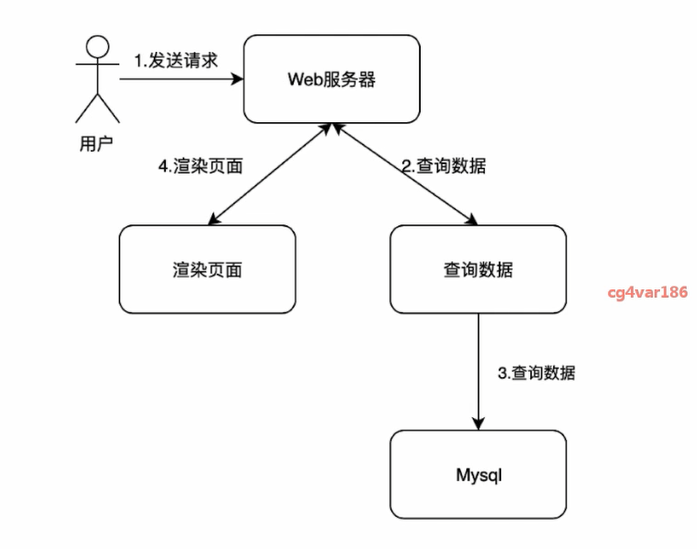
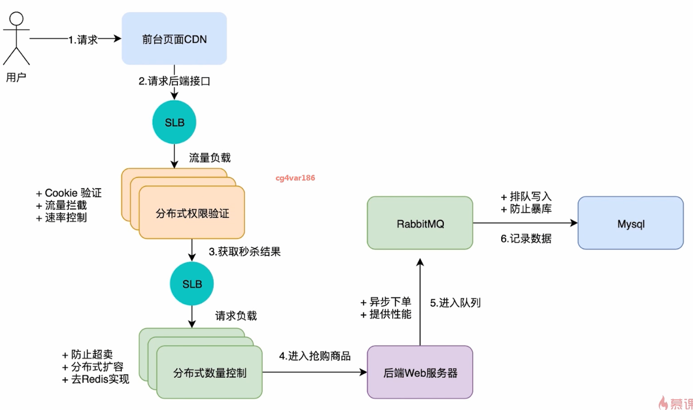
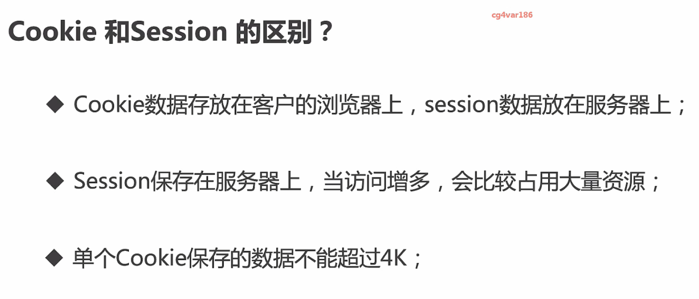
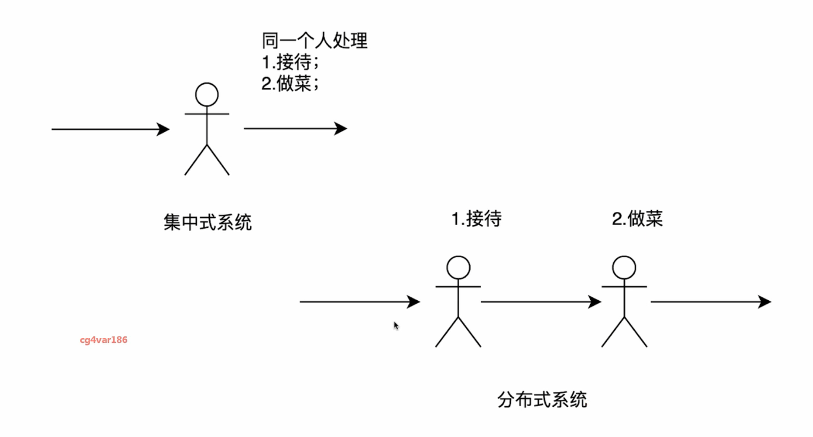
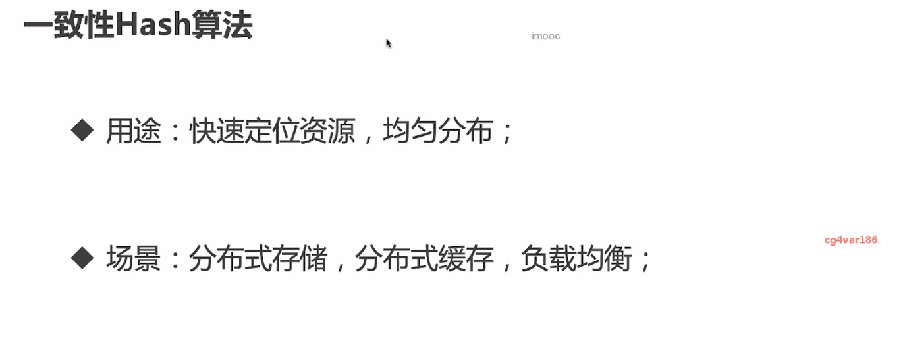
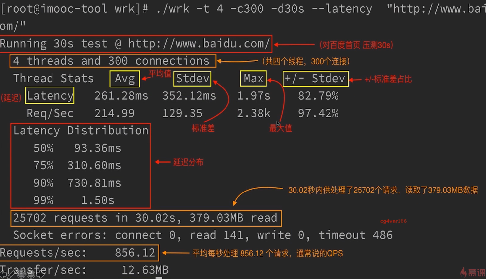
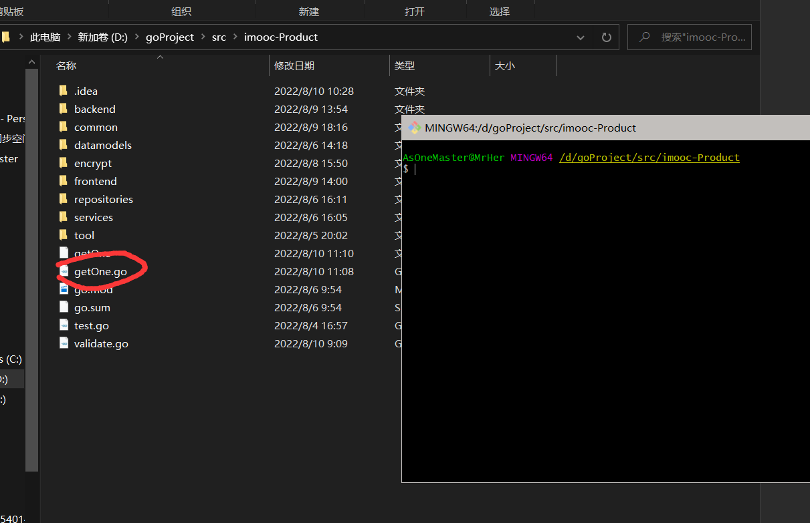
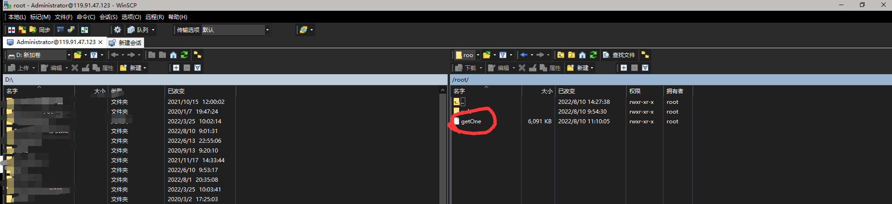
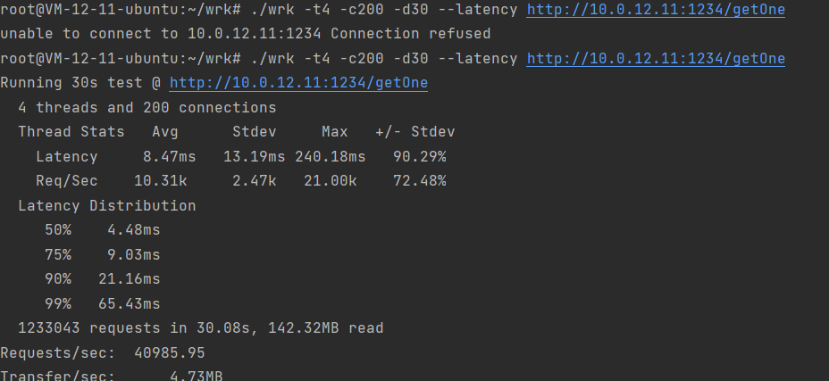

# 秒杀系统优化

## 服务端优化思路：

- 优化前架构：

- 优化后架构：

## 目前未完成 CDN服务搭建  

## 分布式验证 使用validate.go 并在其中引入 数量控制服务（使用getOne.go语言加锁服务器端完成 未使用Redis）

## 分布式系统：

## 一致性哈希

## Wrk压测工具

### 压测工具在云服务器上使用

1. windows上在git命令上进行编译成linux运行文件

    在需要编译的文件目录使用git bash’

2. 使用 GOOS=linux GOARCH=amd64 go buid getOne.go

3. 编译后将文件上传至云服务器 我使用WinSCP直接拖至服务器

4. goland连接远程服务器 （wrk已安装在云服务器上-自学该步骤）

- 开两个会话连接
- 1个cd到getOne文件夹 使用命令行运行服务并开启端口号  ./getOne 
- 1个cd到wrk目录下 使用wrk命令进行压力测试 ./wrk -t4 -c200 -d30 --latency http://10.0.12.11:1234/getOne （http中的地址使用内网地址，端口号为我getOne中开启的端口号）

5. 成功

